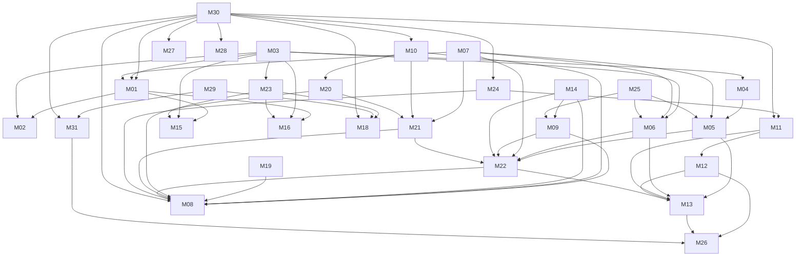

# UADS V2 — Global Module Dependency Graph

Status: FROZEN CANDIDATE — UADS2-WO-004 HEDS PENDING
Machine-readable source: `docs/v2/planning/GLOBAL-MODULE-DEPENDENCIES.json`

## Dependency types

- **HARD** — full module freeze cannot satisfy its primary mission without the predecessor.
- **SOFT_OPTIONAL** — improves capability, but safe fallback exists.
- **EVENT** — evidence/event exchange, usually through M30 or an explicit contract.
- **GOVERNANCE** — acceptance/process constraint, not runtime coupling.
- **ENTERPRISE_CROSSCUTTING** — M27–M31 proof obligation.

Only HARD edges define deep-discovery eligibility.

## HARD graph

The HARD graph is acyclic at WO-004 source lock.

## Topological layers

| Wave | Modules | Meaning |
| --- | --- | --- |
| T0 | M03, M07, M14, M17, M19, M25, M29, M30 | HARD roots. M30 has a bounded runtime foundation from WO-003 but is not yet an S07 module freeze. |
| T1 | M01, M04, M06, M09, M10, M23, M24, M27, M28, M31 | Depends only on T0 HARD predecessors. |
| T2 | M02, M05, M11, M15, M16, M18, M20 | Depends on T0/T1 predecessors. |
| T3 | M12, M21 | Depends through T2. |
| T4 | M22 | Control convergence after routing/gate/retry/context predecessors. |
| T5 | M08, M13 | Review and learning convergence. |
| T6 | M26 | Safe learned-policy rollout/rollback. |

These are **topological layers**, not current eligibility sets and not parallel implementation authorization. Current eligibility is recomputed from S07-frozen HARD predecessors. Only one module enters deep discovery at a time by default.

## First selected module after WO-004

**M03 — Host Capability Detector**

Rationale:
- direct HARD predecessor of M01, M04, M06 and M23;
- indirectly unlocks M02, M05, M15, M16, M18 and future host-aware routing;
- removes a major class of fabricated/assumed-capability defects;
- required in SOLO and useful before adapter/worker deepening.

Current HARD roots are M03, M07, M14, M17, M19, M25, M29 and M30. M03 is selected first. After every module S07 freeze, recalculate eligibility from the machine-readable graph. A bounded foundation such as WO-003 M30 does not by itself satisfy a HARD predecessor freeze requirement. Do not blindly follow a static numeric list.
