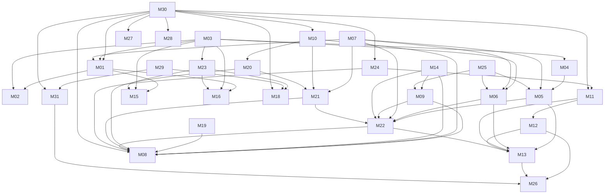

# UADS V2 — Global Module Dependency Graph

Status: FROZEN CANDIDATE — UADS2-WO-004 HEDS PENDING
Machine-readable source: `docs/v2/planning/GLOBAL-MODULE-DEPENDENCIES.json`

## Dependency types

- **HARD** — full module freeze cannot satisfy its primary mission without the predecessor.
- **SOFT_OPTIONAL** — improves capability, but safe fallback exists.
- **EVENT** — evidence/event exchange, usually through M30 or an explicit contract.
- **GOVERNANCE** — acceptance/process constraint, not runtime coupling.
- **ENTERPRISE_CROSSCUTTING** — M27–M31 proof obligation.

Only HARD edges define deep-discovery eligibility.

## HARD graph

The HARD graph is acyclic at WO-004 source lock.

## Eligibility waves

| Wave | Modules | Meaning |
| --- | --- | --- |
| W0 | M30 | Existing runtime foundation from WO-003. |
| W1 | M03, M07, M14, M17, M19, M25, M29, M10 | Root/near-root candidates after M30. |
| W2 | M01, M04, M09, M20, M23, M24, M27, M28, M31 | Eligible as W1 predecessors freeze. |
| W3 | M02, M05, M06, M11, M15, M16, M18, M21 | Execution/routing/adapter/outcome convergence. |
| W4 | M12, M22 | Policy memory + escalation convergence. |
| W5 | M08, M13 | Full review runtime + adaptive learner. |
| W6 | M26 | Safe learned-policy rollout/rollback. |

Waves are **eligibility sets**, not parallel implementation authorization. Only one module enters deep discovery at a time by default.

## First selected module after WO-004

**M03 — Host Capability Detector**

Rationale:
- direct HARD predecessor of M01, M04, M06 and M23;
- indirectly unlocks M02, M05, M15, M16, M18 and future host-aware routing;
- removes a major class of fabricated/assumed-capability defects;
- required in SOLO and useful before adapter/worker deepening.

After every module freeze, recalculate currently eligible modules from the machine-readable graph. Do not blindly follow a static numeric list.
